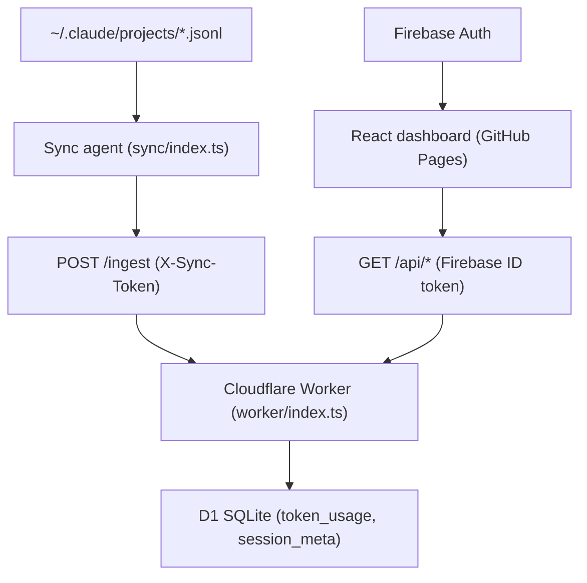

# Architecture Overview

## System diagram

## Components

### Sync agent (`sync/`)
Runs locally on each machine. Reads JSONL files from `~/.claude/projects/`, parses token usage records, classifies sessions, and POSTs to the Worker. Tracks progress via byte-offset cursors in `~/.claude-tracker/cursor.json`.

### Cloudflare Worker (`worker/`)
Stateless HTTP handler. Two auth paths:
- `POST /ingest` — authenticated via `X-Sync-Token` (sync agent)
- `GET /api/*` — authenticated via Firebase ID token (dashboard)

All queries filter by `user_id` for data isolation.

### D1 database
Four tables: `users`, `sync_tokens`, `token_usage`, `session_meta`.
See [[Data model]] for schema.

### React dashboard (`src/`)
Single-page app. Firebase Auth for login. Fetches from Worker on filter change. All charts via Recharts.

## Auth flow
See [[Auth flow]].

## Security model
- CORS restricted to `https://danforthhh.github.io` + localhost — configured in `worker/index.ts`, applied to all responses
- Firebase JWT verified via Google JWK endpoint (Web Crypto API, no external libraries)
- All D1 queries filter by `user_id` (derived from verified token — never from request params)
- Sync tokens: 64-char random hex, stored in plain text in D1, revocable, never expire automatically
- Input sanitization: `days` clamped to 0–3650, `limit` to 1–500, category validated against enum, ingest records validated before DB write

## Dependency graph
See `graphify-out/GRAPH_REPORT.md` for god nodes, community structure, and impact analysis.
